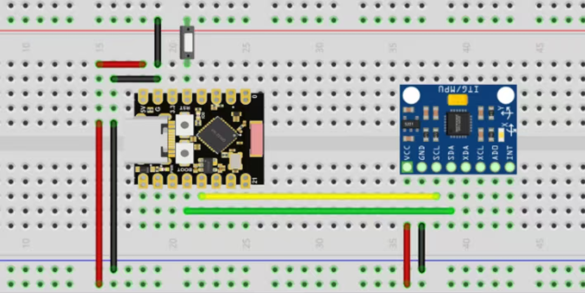
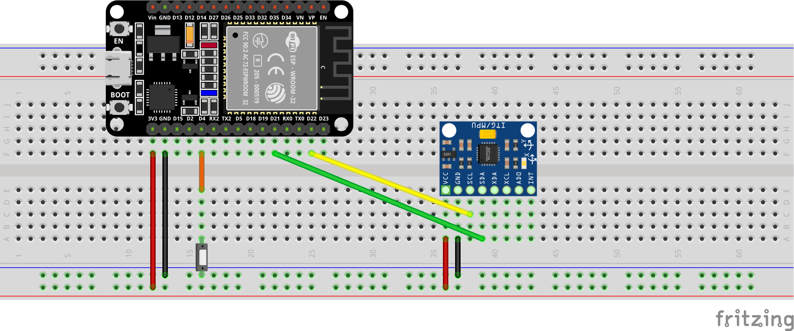
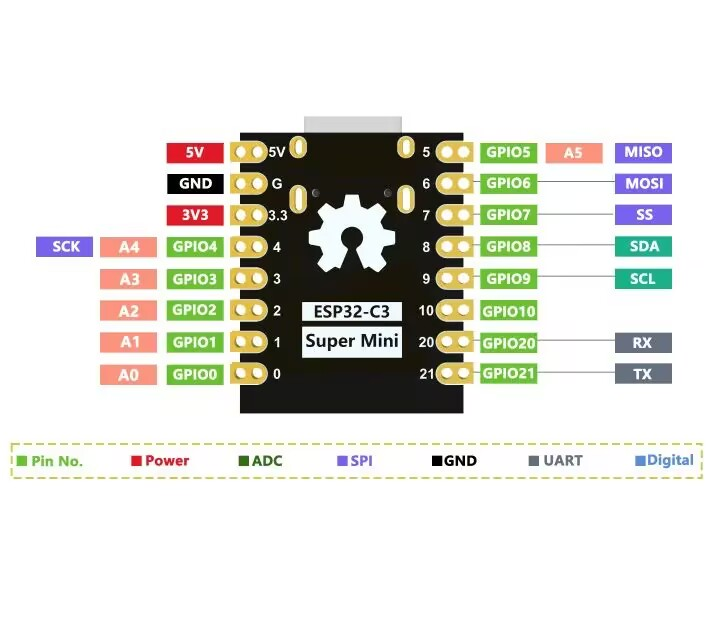
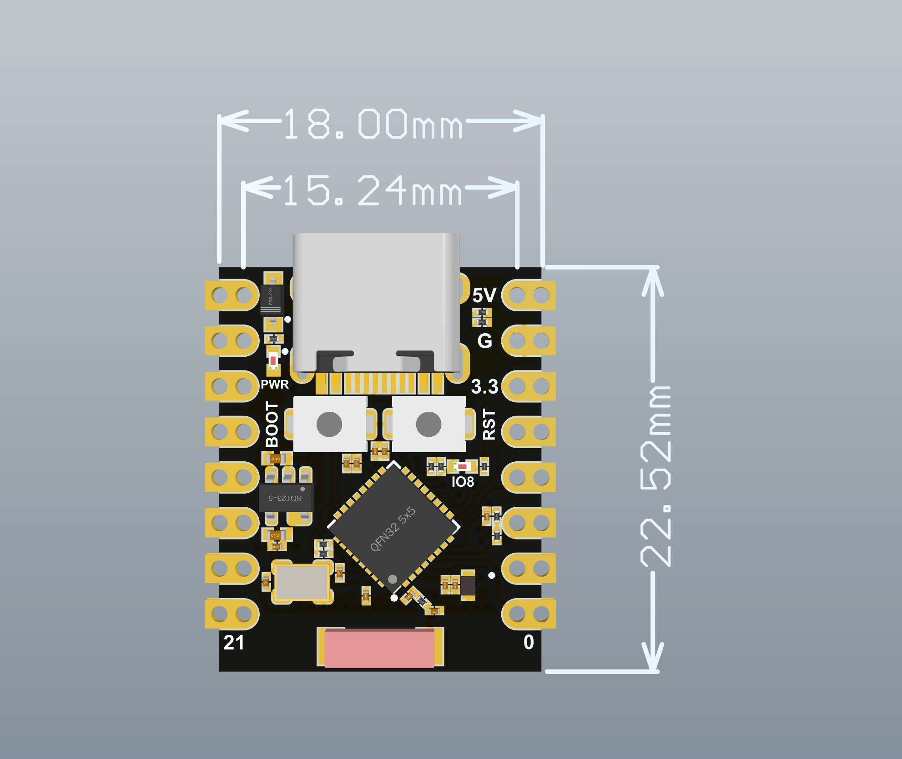
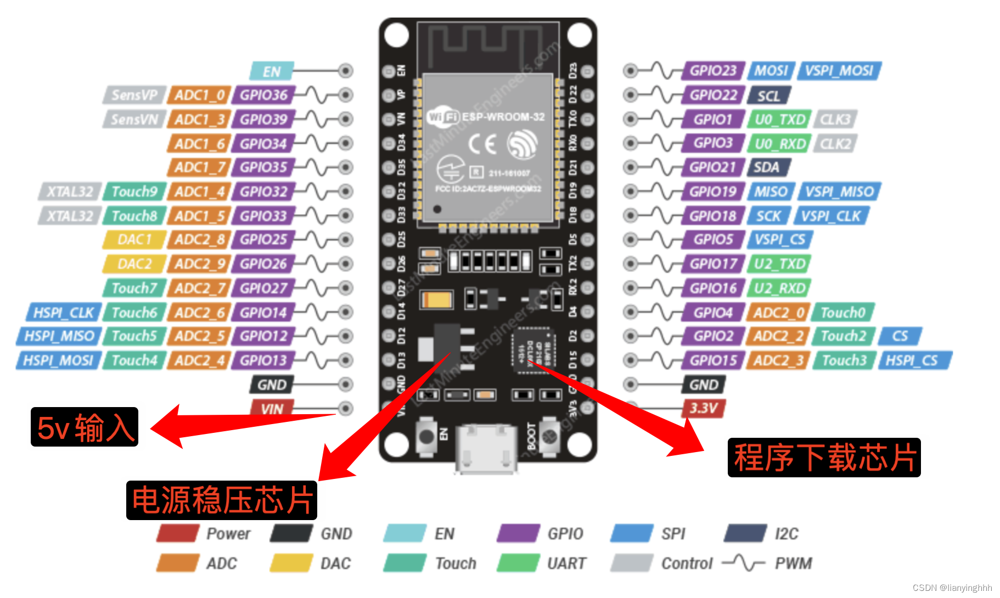
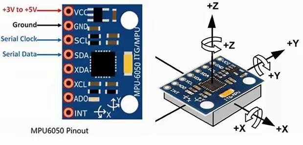
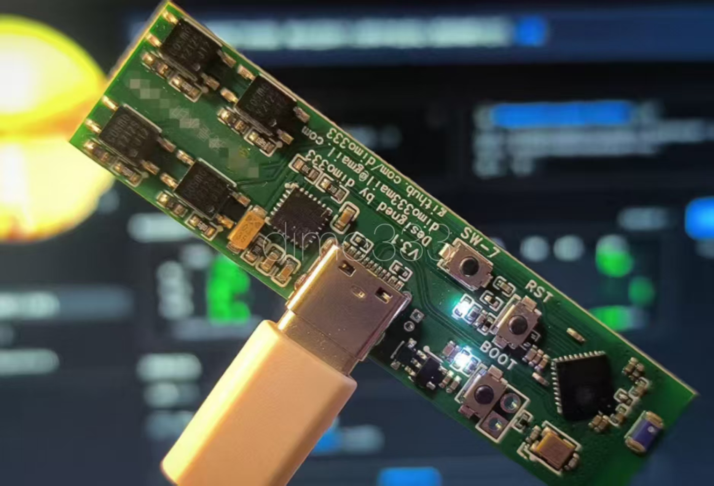

# 🖼️ 硬件参考图集

本目录收录 **接线图、引脚图、开发板与传感器资料图**，方便你复刻魔杖时查阅。
下方 SDA/SCL 引脚以本项目默认的 **ESP32-C3 SuperMini（SDA=GPIO8, SCL=GPIO9）** 为准。

---

## 🔌 接线图（照着连就行）

<table>
  <tr>
    <td align="center" width="50%">
       
      <b>ESP32-C3 SuperMini + MPU6050</b> 
      推荐入门方案的面包板接线
    </td>
    <td align="center" width="50%">
       
      <b>ESP32-WROOM-32 + MPU6050</b> 
      Fritzing 接线（大板方案）
    </td>
  </tr>
</table>

**接线对应关系：** `MPU6050 VCC→3V3`、`GND→GND`、`SCL→SCL(GPIO9)`、`SDA→SDA(GPIO8)`。

---

## 📌 引脚图 / 开发板资料

<table>
  <tr>
    <td align="center" width="33%">
       
      <b>ESP32-C3 SuperMini 引脚图</b> 
      SDA=GPIO8 / SCL=GPIO9
    </td>
    <td align="center" width="33%">
       
      <b>C3 SuperMini 板型尺寸</b> 
      18.00 × 22.52 mm，USB-C
    </td>
    <td align="center" width="33%">
       
      <b>ESP32-WROOM-32 引脚图</b> 
      SDA=GPIO21 / SCL=GPIO22
    </td>
  </tr>
  <tr>
    <td align="center">
       
      <b>MPU6050 引脚 + 坐标轴</b> 
      VCC/GND/SCL/SDA 及 X/Y/Z 方向
    </td>
    <td align="center">
       
      <b>魔杖 PCB 成品（v3.1）</b> 
      自制 PCB 方案实拍
    </td>
    <td></td>
  </tr>
</table>

---

## 📑 文件清单

| 文件 | 内容 | 用途 |
|------|------|------|
| [`wiring-esp32c3-supermini-mpu6050.jpg`](wiring-esp32c3-supermini-mpu6050.jpg) | C3 SuperMini + MPU6050 面包板接线 | 入门方案照着连线 |
| [`wiring-esp32-wroom-mpu6050.png`](wiring-esp32-wroom-mpu6050.png) | WROOM-32 + MPU6050 Fritzing 接线 | 大板方案接线 |
| [`esp32c3-supermini-pinout.png`](esp32c3-supermini-pinout.png) | C3 SuperMini 引脚定义图 | 查 I2C / 按键等引脚 |
| [`esp32c3-supermini-board.jpg`](esp32c3-supermini-board.jpg) | C3 SuperMini 板型与尺寸 | 外壳 / PCB 设计参考 |
| [`esp32-wroom-devkit-pinout.png`](esp32-wroom-devkit-pinout.png) | WROOM-32 开发板引脚图 | 用大板时查引脚 |
| [`mpu6050-pinout-axes.png`](mpu6050-pinout-axes.png) | MPU6050 引脚与坐标轴方向 | 接线 + 理解录数据的轴 |
| [`wand-pcb-hero.jpg`](wand-pcb-hero.jpg) | 自制魔杖 PCB 成品照 | 项目展示 / 首页头图 |

> 💡 **轴的方向**很关键：`mpu6050-pinout-axes.png` 里的 X/Y/Z 决定了你录数据、训练、烧录时该选哪两个轴，三处必须一致。
